## WE:A(We are Artist!) : 우리동네 아티스트 후원 플랫폼

**앱 하나로 우리 동네 공연 정보를 확인하고, 쉽고 간편하게 후원하는 인디 공연 플랫폼**


<br/>

## 📜 프로젝트 개요

### **_나랑 같이 우리 동네 공연보러 갈래?_**

**WE:A(We are Artist)** 는 지역 공연 예술가들의 활동을 지원하고, 관객과 아티스트 간의 연결을 강화하는 인디 공연 앱 플랫폼입니다. 이 애플리케이션은 사용자에게 주변 지역의 다양한 공연 및 문화 이벤트 정보를 손쉽게 찾아보고, 참여하고 후원할 수 있는 기회를 제공합니다.

소중한 사람과 함께 공연을 보러 가고 싶을 때, WE:A를 한번 사용해보는건 어떨까요?

<br/>

## 📃 주요기능

### 1. 공연 정보 검색
- WEA 앱을 통해 사용자는 주변 동네에서 진행되는 다양한 공연과 문화 이벤트 정보를 검색하고 살펴볼 수 있습니다. 편리한 검색 및 필터링 옵션을 통해 사용자는 자신의 관심사에 맞는 이벤트를 찾을 수 있습니다.

### 2. 간편결제(토스 API)를 사용한 공연 후원 시스템
- 오늘, 우리 동네에서 공연하는 아티스트의 정보를 확인하고 앱에서 간편하게 후원을 하실 수 있습니다. 관심 있는 공연에 후원을 하면 당신만을 위한 티켓 발급까지! 특별한 날 소중한 추억을 앱 하나로 간편하게 간직해보세요!

### 3. 아티스트 프로필 확인
- WE:A는 우리 동네 사는 누구나 아티스트가 될 수 있습니다. 간단하게 공연자의 프로필을 작성하고 심사를 요청하시면, 아티스트를 위한 프로필 페이지를 제공하여 관객들과 소통하고 나만의 히스토리를 기록해나갈 수 있습니다. 

### 4. 아티스트 순위 확인
- 오늘은 어떤 아티스트의 공연을 봐야할 지 고민이시라구요? WE:A는 누적된 데이터를 통해 아티스트의 순위 정보를 제공하여 아티스트와 관객이 더 적극적으로 이어질 수 있도록 만남의 장을 조성하고 있습니다. 지금 바로, 오늘의 인기스타가 되어보시는 것은 어떨까요?
<br>

## 🎬 프로젝트 기간

#### 2023. 07. 02. (일) ~ 2023. 11. 05. (일) (18주)

<br/>

## 🛠 프로젝트에 사용된 기술

**Back-end : Spring Boot**
```
- Springboot x.x.x
- Spring Data JPA
- Spring Security
- db?
```

**Android**

```
## 빌드 도구 : gradle(KOTLIN DSL)
## Programming Settings
- Kotlin 1.9.0-release-358
- Gradle 8.1
- compileSdk 33
- minSdk  26
- targetSdk 33
- Java 8

## develop kit settings
### ui develop kits
- androidx.core:core-ktx:1.9.0
- androidx.lifecycle:lifecycle-runtime-ktx:2.6.1
- androidx.activity:activity-compose:1.7.0
- androidx.navigation:navigation-compose:2.5.3
### constraintlayout for toss payments layout
- androidx.constraintlayout:constraintlayout:2.1.4

## asynchronous communication tools
### retrofit2 and okhttp
- com.squareup.retrofit2:retrofit:2.9.0
- com.squareup.retrofit2:converter-gson:2.9.0
- com.squareup.okhttp3:okhttp-urlconnection:4.9.1
- com.squareup.okhttp3:logging-interceptor:4.9.1
- com.squareup.okhttp3:okhttp:4.9.3
- com.squareup.okhttp3:logging-interceptor:4.9.3

### Coroutines
- org.jetbrains.kotlinx:kotlinx-coroutines-android:1.6.0

### glide compose
- com.github.skydoves:landscapist-glide:1.4.7


## APIs, other develop kits
### naver map sdk
- com.naver.maps:map-sdk:3.17.0

### 구글 광고, admobs
- com.google.android.gms:play-services-ads:22.3.0

### toss-api, 간편 결제 api
- com.github.tosspayments:payment-sdk-android:0.1.11
```

**CI/CD**

```
- 
```

<br/>

## 🚩 Project Info

### 1. 프로젝트 아키텍처(Project Architecture)


### 2. E-R Diagram


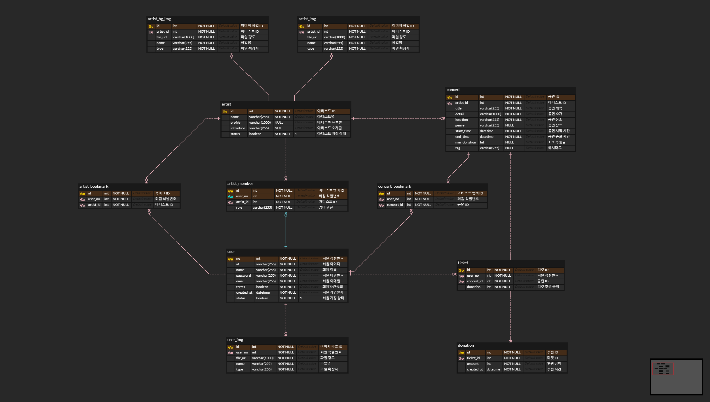

### 3. 프로젝트 워크스페이스(노션, Notion)
[프로젝트 워크스페이스 보러가기](https://secret-nebula-014.notion.site/WE-A-152d47344b7d449290d44811aee37d5a?pvs=4)

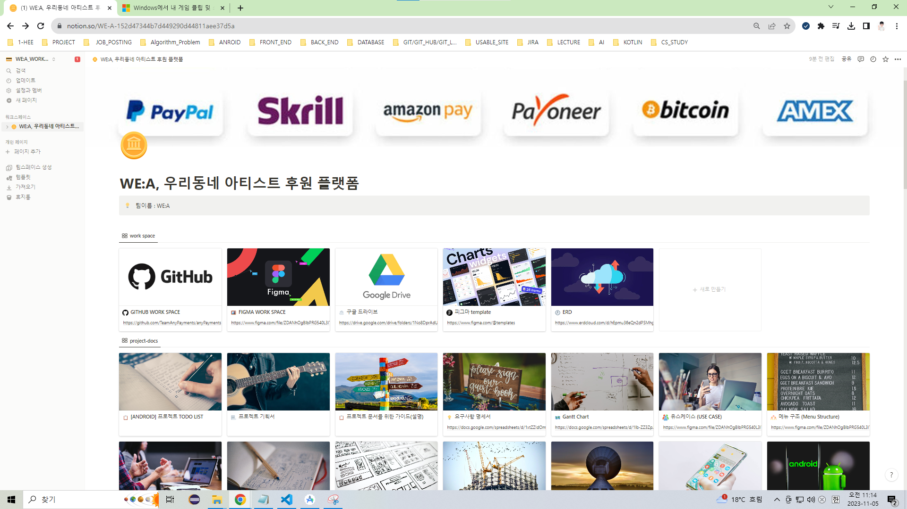
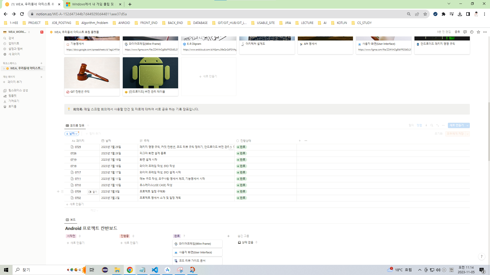


### 4. 요구사항 명세서
[요구사항 명세서 보러가기](https://docs.google.com/spreadsheets/d/1xtZZIdOm18zNBqhUbdQQi8cfbaRAYBCD/edit?usp=sharing&ouid=102208980798385722229&rtpof=true&sd=true)

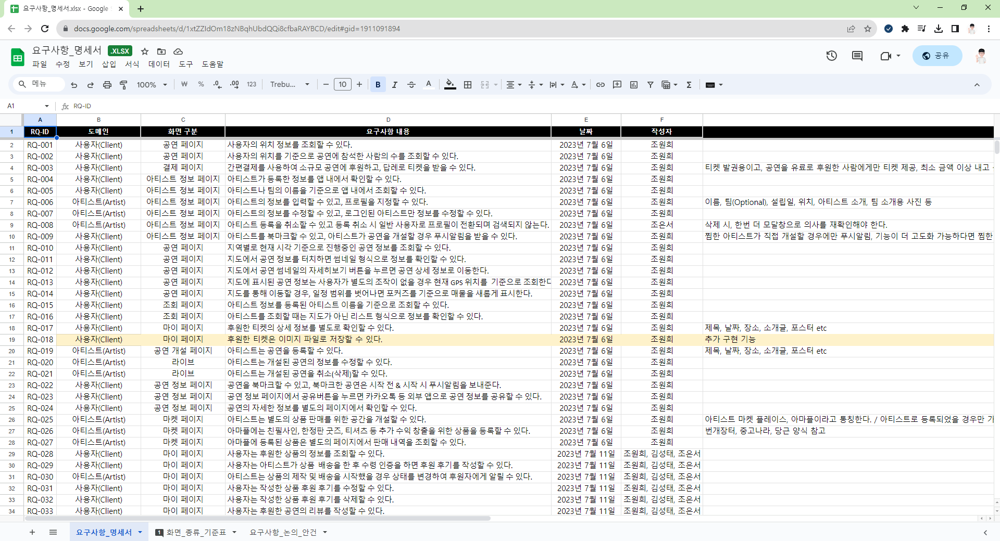


### 5. API 명세서
[API 명세서 보러 가기](https://www.notion.so/API-03cafb39cd8c4175bd26cbf86fc11f44)

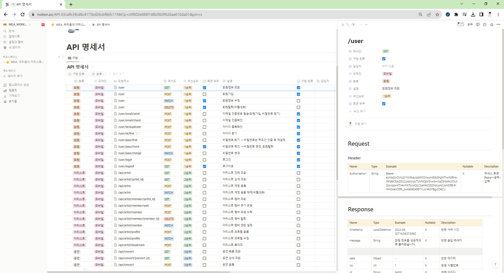

### 6. 유스케이스(USE CASE)
[유스케이스 보러 가기](https://www.notion.so/USE-CASE-33c6d180ddf64566a773624e4d864ce3)


### 7. 메뉴 구조도(Menu Structure)
[메뉴 구조도 보러가기](https://www.notion.so/Menu-Structure-1b569cfd18654f418259a2eae92b1936)


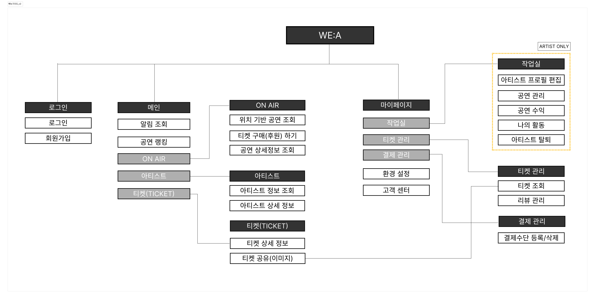

### 8. 깃 컨벤션 규칙(Git Convention rules)
[깃 컨벤션 규칙 보러가기](https://www.notion.so/GIT-4c22984719314bdb89e4fad741ed174e)

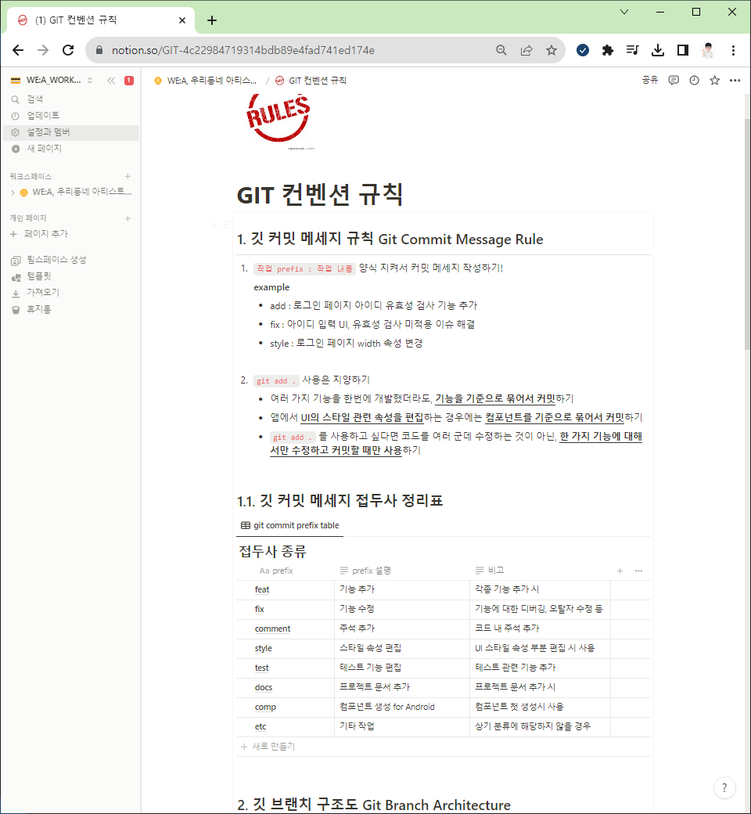
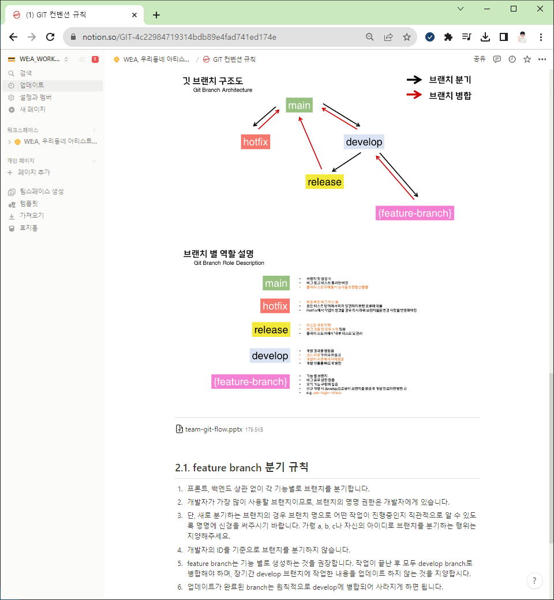


### 9. 와이어 프레임(Wire Frame)
[와이어 프레임 보러가기](https://www.notion.so/Wire-Frame-b567020010614f229b9b45fc19fd1740)

### 아티스트 와이어 프레임
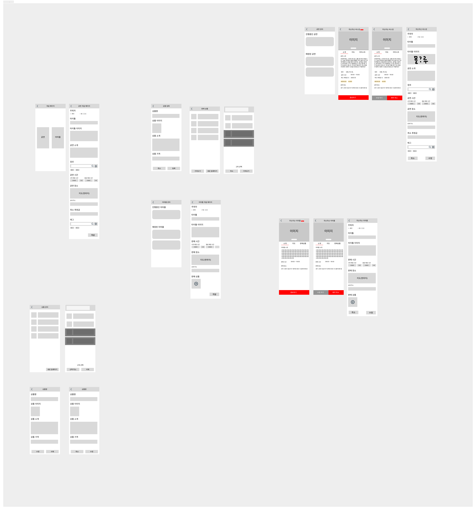

### 관객 와이어 프레임
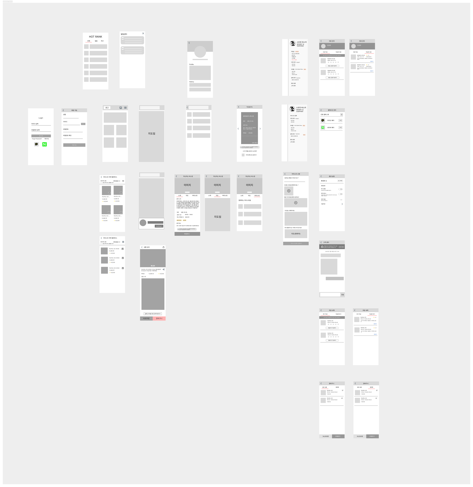


### 10. 사용자 화면(UI, User Interface)
[사용자 화면 보러가기](https://www.notion.so/User-Interface-5742ab1b1c184330a0a9afb09c5d165c)

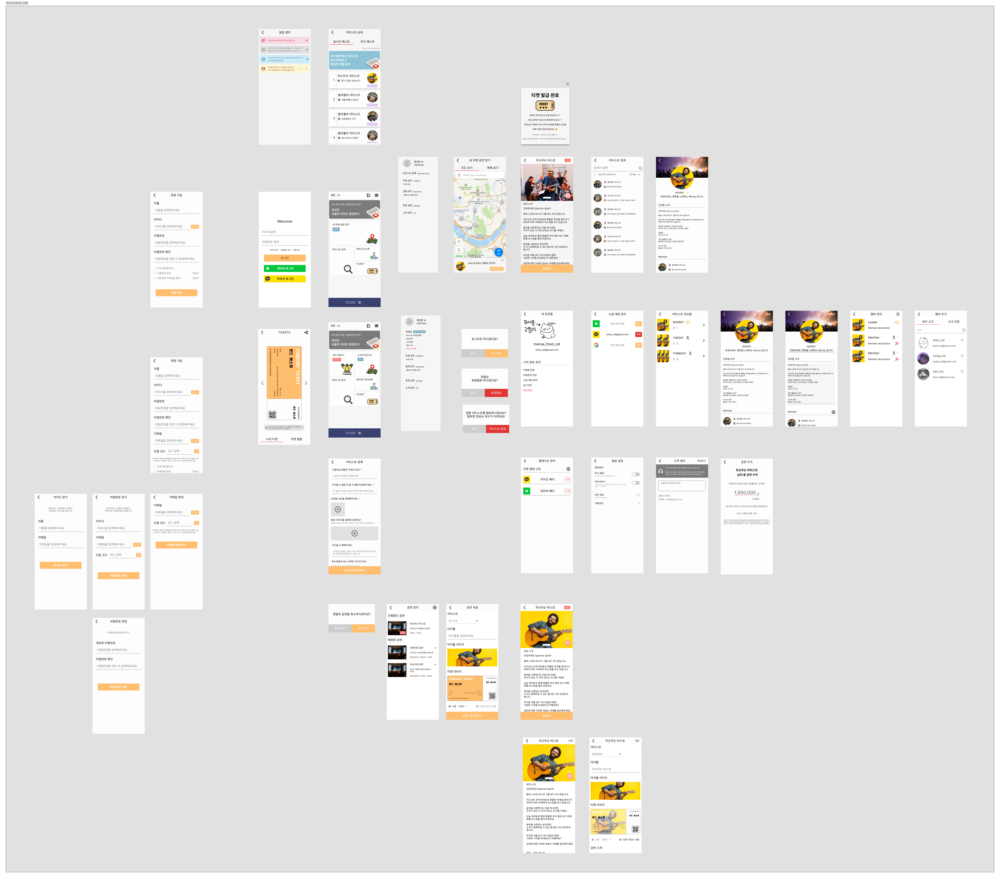

---

## 👀 서비스 화면 (동영상)


### Project Member - 이산가족
- 조원희 (Team Leader, Android Developer)
- 김성태(Android Developer, CI/CD)
- 조은서(BackEnd, Backend Leader),
- 김주하(BackEnd)
